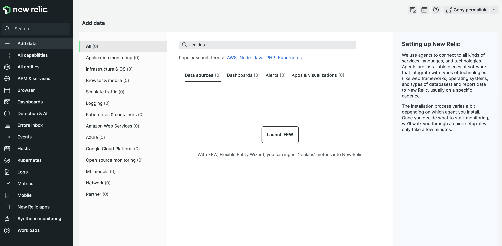
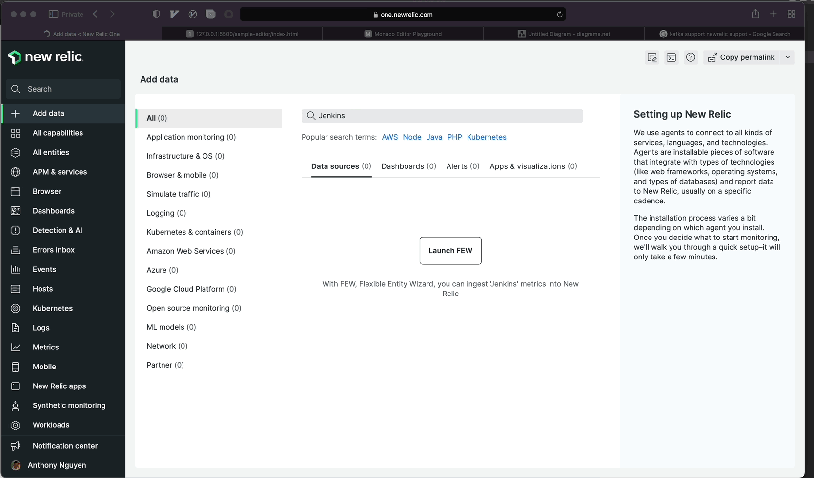
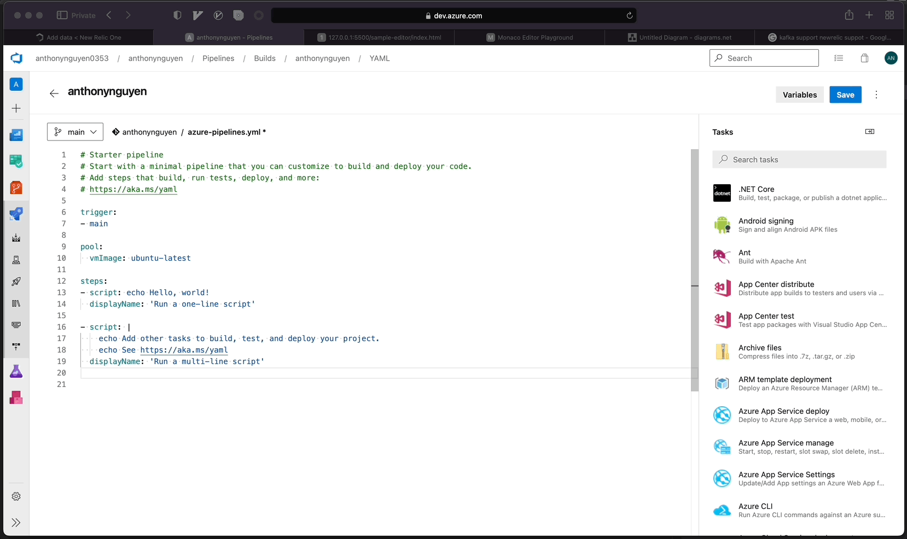
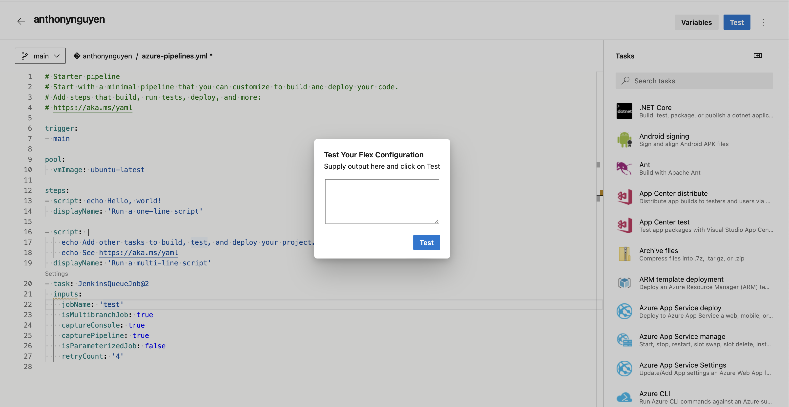
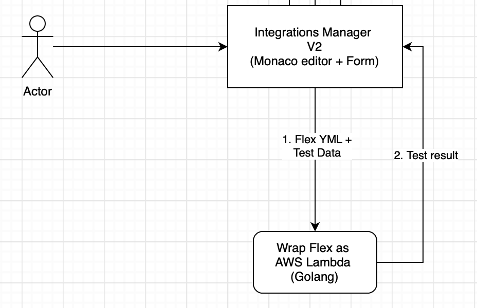
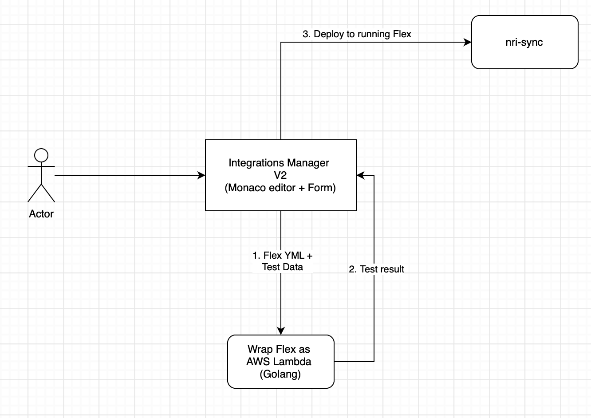
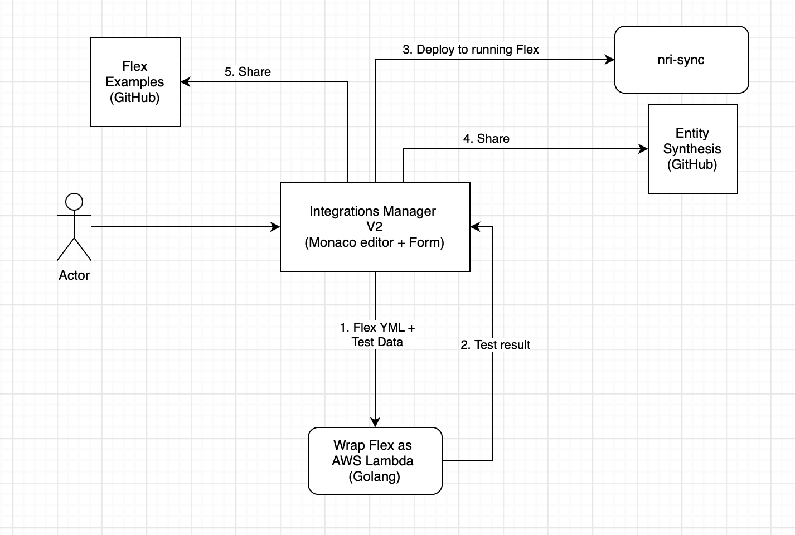

# Customer want to monitor Jenkins 

### ... but there is no out of the box integration for Jenkins

# User can use Wizard (form) to configure Flex instead of working with Yaml

# User can test Flex Yaml directly inside NR1 (no installation required)

## How can you test Flex YAML without Flex installed??

# User deploy to nri-sync

# User add Entity Synthesis and share it

