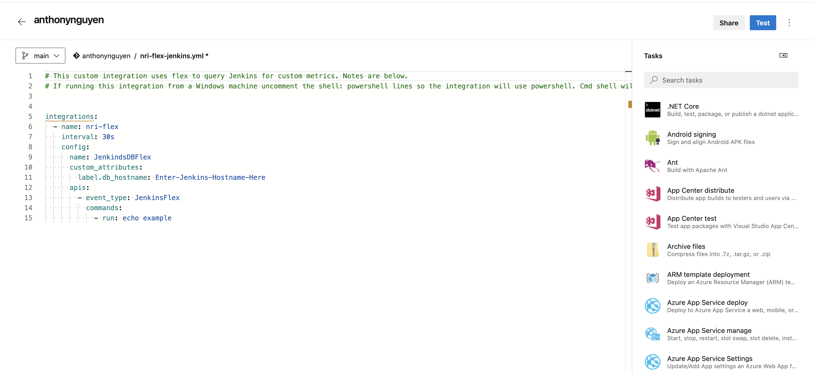
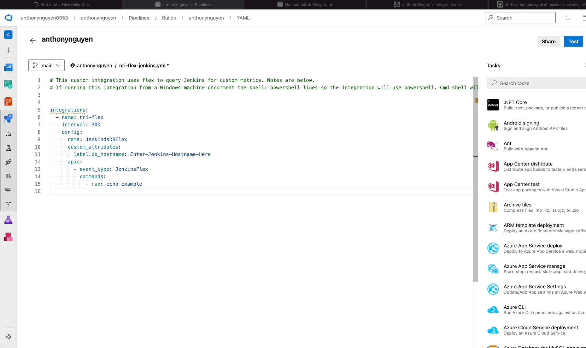
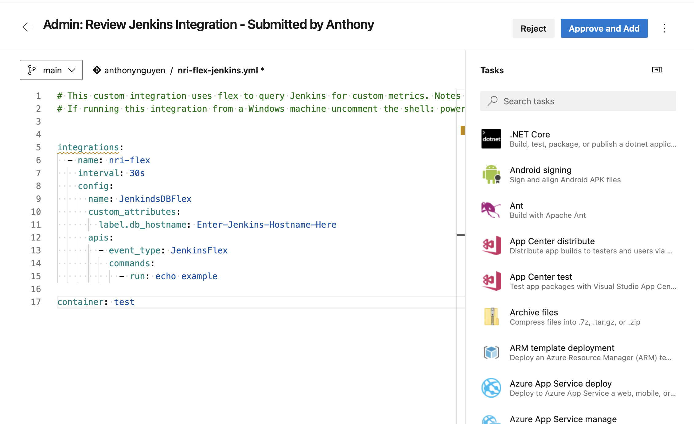

# Customer want to monitor Jenkins 

#### ... but there is no out of the box integration for Jenkins

#### ... Click `Launch FEW`

#### ... with Syntax Highlighting and Intelisense

#### .... user can use Wizard (form) to configure Flex instead of working with Yaml

#### .... user can test Flex Yaml directly inside NR1 (no installation required)

#### How can you test Flex YAML without NR Infra agent??

#### .... user then deploy to nri-sync (Integrations Manager Nerdlet)

#### .... user add Entity Synthesis and share it (via app)

#### .... NR Admin can review/test/approve and merge Entity Synthesis or Flex Integration directly in the app

